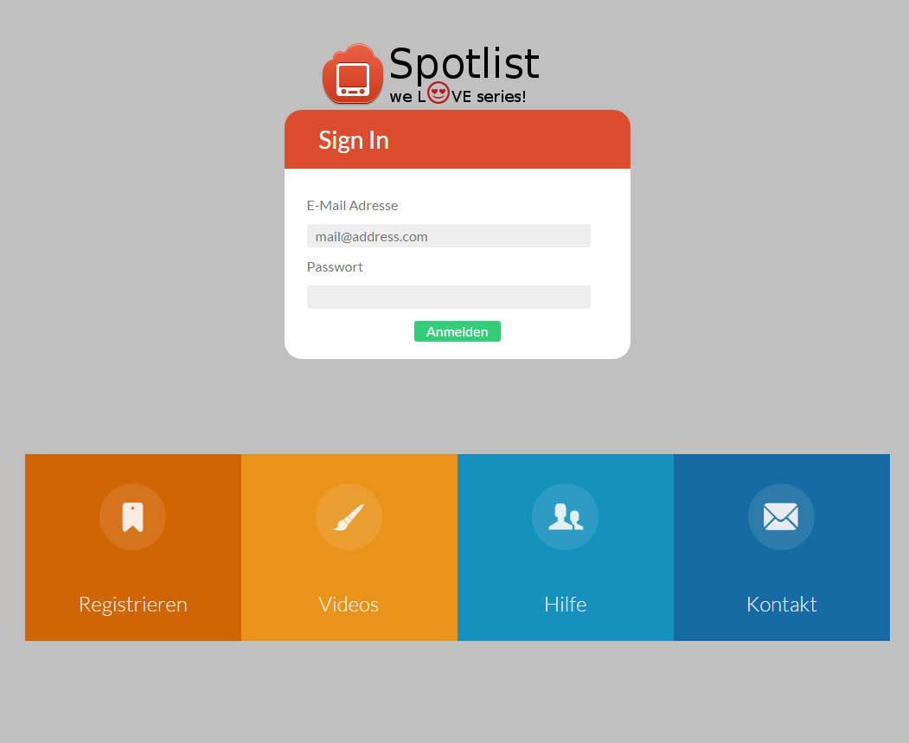
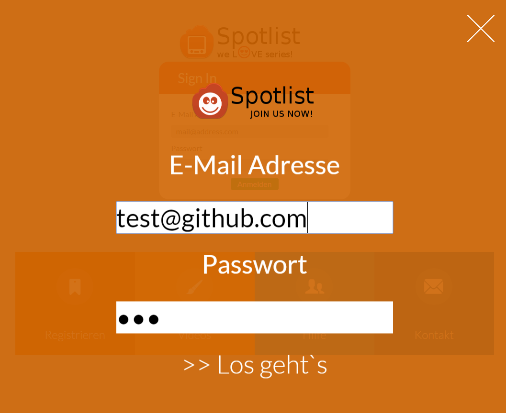
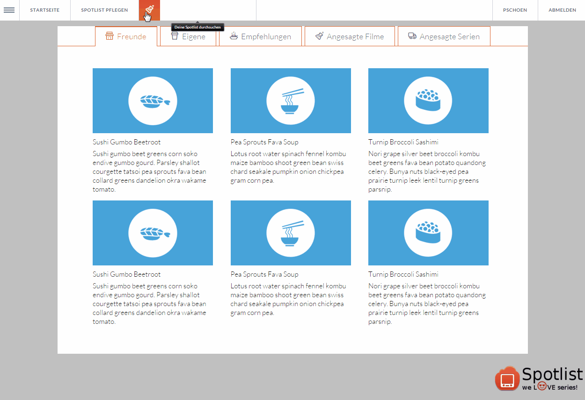

# Spotlist Desktop (Demo - Tech Tests)

ToDo:
 - Connect Movie / Series DB APIs
 - Share and Log watched files
 - social upgrade the spotlist
 - Easy Rate and comment progress
 - open API for i.e. One Click Hoster Platforms to use that ratings
 - facebook like newstream with recommended movies / series and movies / series added by friends
 - Backend is coded in PHP but the framework is not open source (so we need a new backend)
 - structured milestones and task group definitions
 

